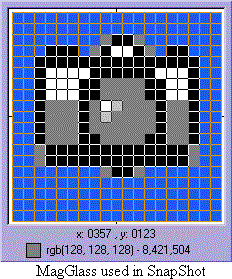



## SnapShot

### Description

SnapShot is a simple screen capture program that allows you to select and save selected areas of you desktop. It is well documented and should be easy to understand. Full souce code included.

Jim Benvenuti

benj@sympatico.ca
 
### More Info
 
Uses only vb common controls including Common Dialog control6.0 (sp3)

Able to save selected screen capture to clipboard or disk.

             |
---                |---
**Submitted On**   |2001-02-20 13:25:52
**By**             |[Jim Benvenuti](https://github.com/Planet-Source-Code/PSCIndex/blob/master/ByAuthor/jim-benvenuti.md)
**Level**          |Advanced
**User Rating**    |5.0 (20 globes from 4 users)
**Compatibility**  |VB 6\.0
**Category**       |[Graphics](https://github.com/Planet-Source-Code/PSCIndex/blob/master/ByCategory/graphics__1-46.md)
**World**          |[Visual Basic](https://github.com/Planet-Source-Code/PSCIndex/blob/master/ByWorld/visual-basic.md)
**Archive File**   |[CODE\_UPLOAD152532202001\.zip](https://github.com/Planet-Source-Code/jim-benvenuti-snapshot__1-21194/archive/master.zip)

### API Declarations

Api declarations are in ApiMod.bas in the zip file

